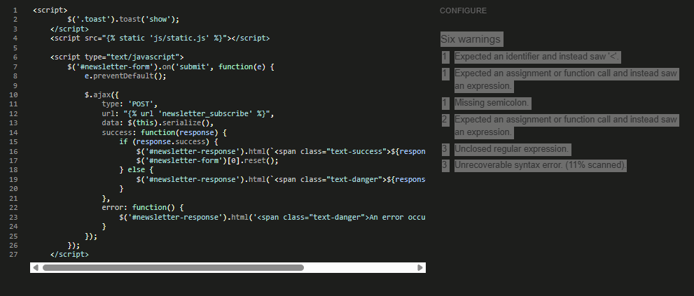
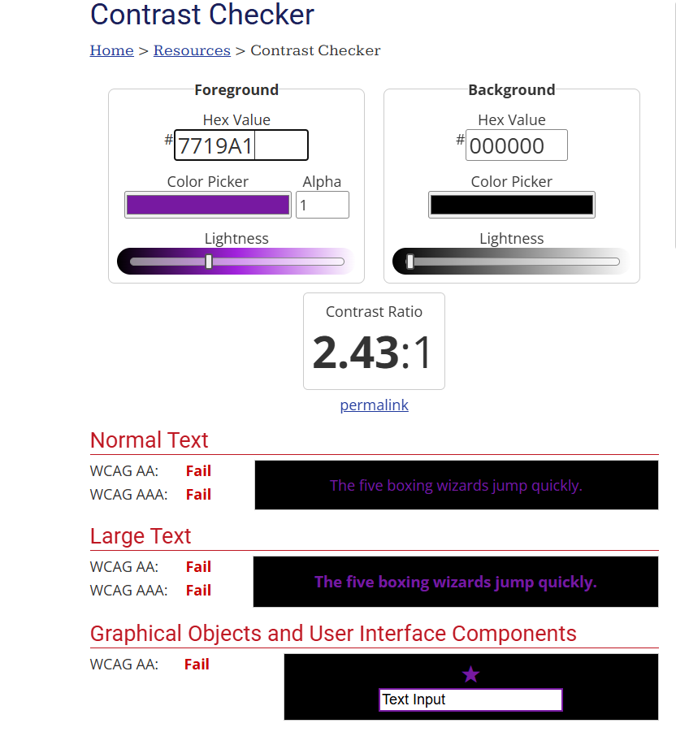
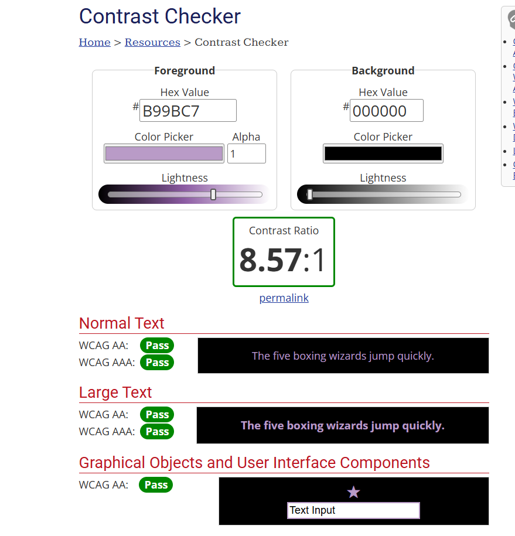
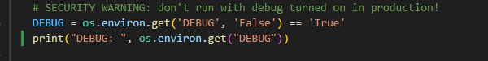
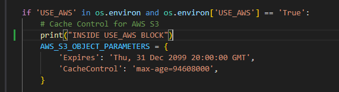
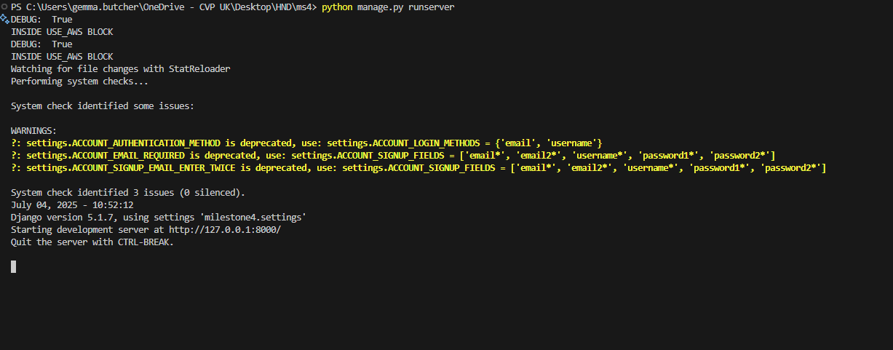

### Javascript
- During development of js code and using JS Hint to verify the code, there were a few errors coming up. However this is due to Django syntax being used within the script which js hint doesnt recognise or
take into consideration. However with this considered the js code does pass criteria.
The JS errors are shown below.

### Contrast
#### Logo Text
- During development and testing with webaim a persistant contrast issue arose. It was on the nav bar logo text. The purple hyphen was shwoing as not meeting contrast criteria. 
- Although it is text designed to look like a logo, and could be argues that it could be dismissed, the text will still need to be accessible which it was not.
- The original contrast was a background of #000000 with the hyphen being #7719a1.

- The updated contrast is a background of #000000 with the hyphen being #ff6b6b. This is now consistent with the site footer which makes the branding more consistent.

### Integrations and API's
#### AWS
- During development there was some lag and it was queried if images were being served from AWS as expected. 
- 2 statements were used and printed tot he console to test the connection was working correectly
- Below is the stement used to print tot he console to confirm the connection was working as expected in the code logic.

- Below is the code used to images werent being cached incorrectly and making it appear in the browser that the connection and serving of images was incorrect.

- Here is a terminal screenshot below of the printed statemnt and how that appears in the console. This confirms that the static images are ebing served from AWS.

