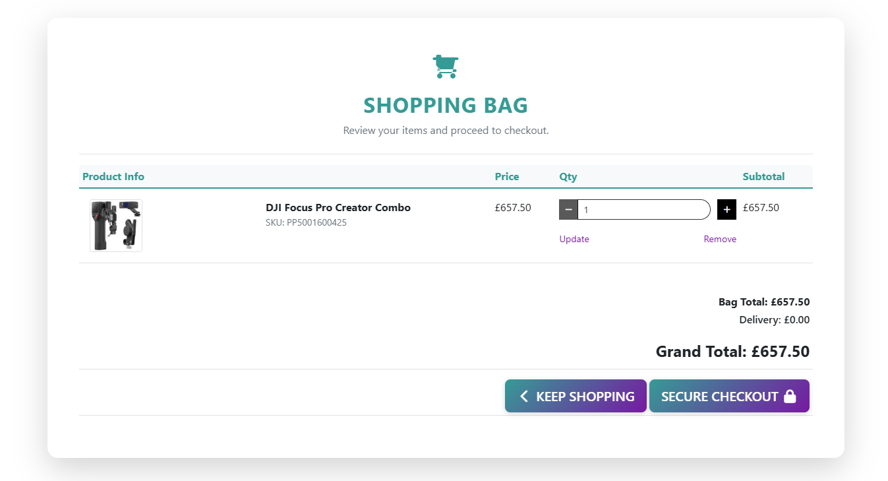
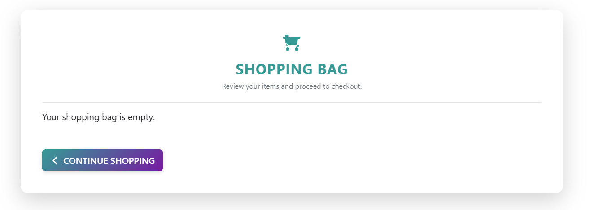
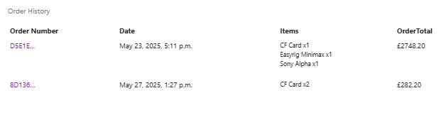
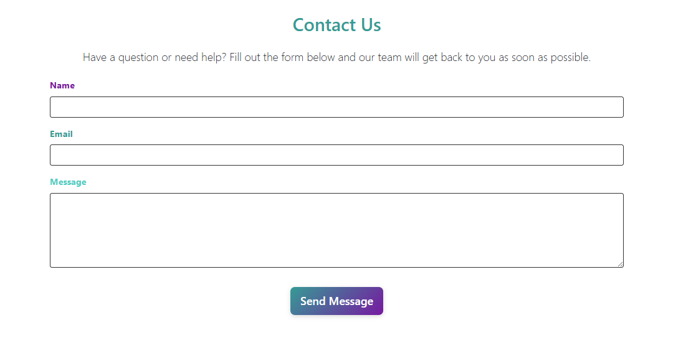
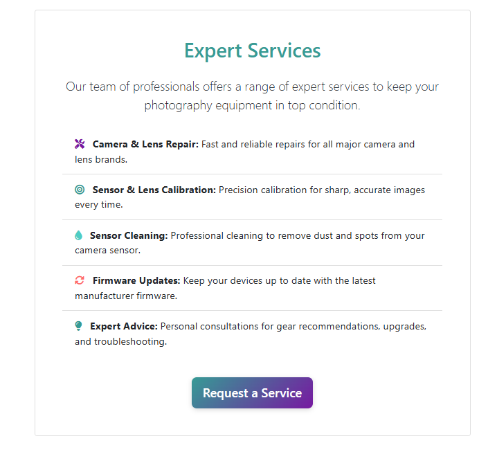
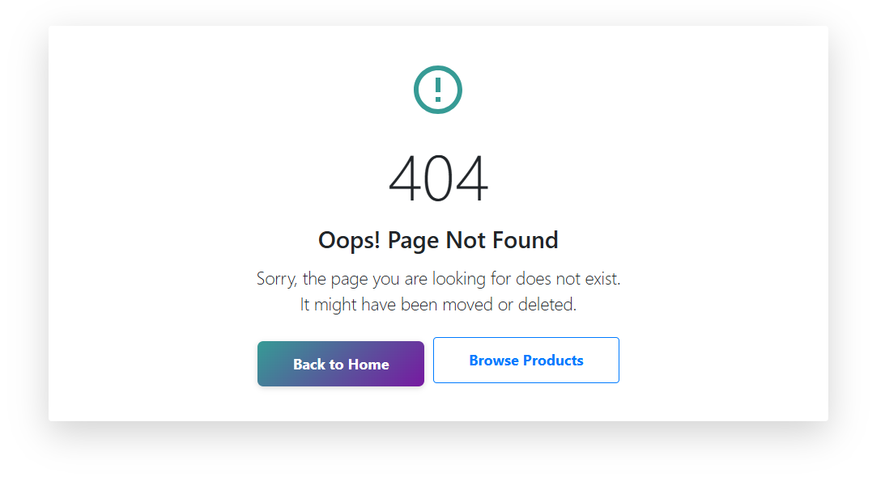

<div align="center">
  
</div>

**[🚀 View Live Site: I-Snap](https://i-snap-110e214ae896.herokuapp.com/)**

## Table of Contents
1. <details open>
    <summary><a href="#ux">UX</a></summary>

    <ul>
    <li><details>
    <summary><a href="#goals">Goals</a></summary>

    - [Visitor Goals](#visitor-goals)
    - [Business Goals](#business-goals)
    - [Business Plan](#business-plan)
    - [User Stories](#user-stories)
    </details></li>

    <li><details>
    <summary><a href="#visual-design">Visual Design</a></summary>

    - [Wireframes](#wireframes)
    - [Fonts](#fonts)
    - [Icons](#icons)
    - [Colors](#colors)
    - [Images](#images)
    - [Styling](#styling)
    </details></li>

    <li><details>
    <summary><a href="#seamless-design">Seamless Design</a></summary>

    - [Preloader](#preloader)
    - [AJAX](#AJAX)
    - [Toasts](#toasts)
    </details></li>
    </ul>
</details>

2. <details open>
    <summary><a href="#features">Features</a></summary>

    <ul>
    <li><details>
    <summary><a href="#page-elements">Page Elements</a></summary>

    - [All Pages](#all-pages)
    - [Product List Page](#product-list-page)
    - [Product Detail Page](#product-detail-page)
    - [Account Pages](#account-pages)
    - [Shopping Bag Pages](#shopping-bag-pages)
    - [Checkout Pages](#checkout-pages)
    - [Contact Page](#contact-page)
    - [Services Page](#services-page)
    - [404 Page](#404-page)
    </details></li>

    <li><details>
    <summary><a href="#additional-features">Additional Features</a></summary>

    - [General](#general)
    - [Users](#users)
    - [Search Features](#search-features)
    </details></li>

    <li><details>
    <summary><a href="#future-features">Future Features</a></summary>

    - [Basic](#basic)
    - [Content](#content)
    - [User Features](#user-features)
    </details></li>
    </ul>
</details>

3. <details open>
    <summary><a href="#information-architecture">Information Architecture</a></summary>

    <ul>
    <li><details>
    <summary><a href="#database-structure">Database Structure</a></summary>

    - [Details](#details)
    - [Entity Relationship Diagram](#diagram)
    </details></li>    

    <li><details>
    <summary><a href="#data-models">Data Models</a></summary>

    - [Checkout App](#checkout-app)
    - [Contact App](#contact-app)
    - [Products App](#products-app)
    - [Users App](#users-app)
    - [FAQ App](#faq-app)
    </details></li>
    </ul>
</details>

4. <details open>
    <summary><a href="#technologies-used">Technologies Used</a></summary>

    - [Languages](#languages)
    - [Frameworks](#frameworks)
    - [Libraries](#libraries)
    - [Packages](#packages)
    - [Platforms](#platforms)
    - [Other Tools](#other-tools)
</details>

5. <details open>
    <summary><a href="#testing">Testing</a></summary>

    <ul>
    <li><details>
    <summary><a href="#automated-testing">Automated Testing</a></summary>

    - [Validation](#validation)
    - [Python Testing](#python-testing)
    - [Coverage](#coverage)
    - [Coveralls](#coveralls)
    </details></li>

    <li><details>
    <summary><a href="#manual-testing">Manual Testing</a></summary>

    - [General Testing](#general-testing)
    - [Mobile Testing](#mobile-testing)
    - [Desktop Testing](#desktop-testing)
    </details></li>

    <li><details>
    <summary><a href="#bugs">Bugs</a></summary>

    - [Known Bugs](#known-bugs)
    - [Fixed Bugs](#fixed-bugs)
    </details></li>
    </ul>
</details>

6. <details open>
    <summary><a href="#deployment">Deployment</a></summary>

    <ul>
    <li><details>
    <summary><a href="#local-deployment">Local Deployment</a></summary>

    - [Local Preparation](#local-preparation)
    - [Local Instructions](#local-instructions)
    </details></li>

    <li><details>
    <summary><a href="#heroku-deployment">Heroku Deployment</a></summary>

    - [Heroku Preparation](#heroku-preparation)
    - [Heroku Instructions](#heroku-instructions)
    </details></li>
    </ul>
</details>

7. <details open>
    <summary><a href="#credit-and-contact">Credit and Contact</a></summary>

    - [Images](#local-preparation)
    - [Code](#local-instructions)
</details>

----

# UX
## Goals
### Visitor Goals
The target audience for I-Snap are:
- People who want to purchase cameras and accessories for professional and hobby use.
- People who are interested or work in photography, videography and broadcasting.
- People that want to browse through various equiptment.
- Professionals seeking high end equiptment for broadcasting and cinemography.
- Shoppers that don't know what they want, but want to explore and browse.

User goals are:
- Find the piece of equipment they were looking for or find something that meets their search requirements.
- Explore detailed product specifications.
- See what's new and exciting when new products are released.
- Navigate the store and sections easily through different kinds of camera related products.
- Make a secure purchase.

I-Snap fills these needs by:
- The site follows standard design conventions of a shop with regard to menus, checkout, categories, etc, offering familiarity and good UX.
- Searching and product pages include similar items, categories and are organised by popularity, so the customer sees the most engaging goods first.

### Business Goals
The Business Goals of I-Snap are:
- Offer an easy to use, professional looking online pshopping experience.
- Maintain site traffic through new and relevant product and content.
- Keep the site interesting with new different stock incoming frequently.
- Have customers feel they are purchasing through a trustworthy source.

### Business Plan
# 📷 I-Snap – E-commerce Camera & Accessory Store

**I-Snap** is a Django-powered e-commerce platform for selling high-quality cameras, lenses, and accessories. Our goal is to provide enthusiasts and professionals with expert-vetted gear and a seamless shopping experience.

---

## 🚀 Overview

- **Platform:** Django (Backend), PostgreSQL (Database), Stripe/PayPal (Payments)
- **Focus:** Online sales of camera gear & accessories
- **Target Market:** Photographers, content creators, vloggers
- **USP:** Product matching tools, expert content, potential for rentals/used gear

---

## 🎯 Objectives

### Short-term (0–1 year)
- Launch MVP and acquire first 1,000 sales
- Reach £10,000/month revenue
- Build product review system and compatibility checker

### Long-term (2–5 years)
- Offer professional video equipment rentals and used equipment sales
- Add AI-powered product suggestions
- Become a top-3 niche tech-gear store online

---

## 🛒 Features
🔍 Advanced product search & filters<br>
📄 Frequently Asked Questions (FAQ) section for customer self-help<br>
📬 Contact form with message storage in the database (for support & inquiries)<br>
💳 Secure checkout with Stripe/PayPal<br>
🛠️ Admin panel for inventory management, FAQ management and updates<br>
📦 Order tracking & fulfillment integration<br>
📦 User profile page including current and previous orders


---

## 🛠️ Tech Stack

| Layer        | Tech                          |
|--------------|-------------------------------|
| Backend      | Django, Django REST Framework |
| Frontend     | Django templates / React (optional) |
| Database     | PostgreSQL                    |
| Payments     | Stripe, PayPal                |
| Hosting      | AWS / Heroku        |
| Dev Tools    | Docker, GitHub Actions        |
| Auth         | Django Allauth / Custom       |
| SEO & Analytics | Brightedge, Google Analytics |

---

## 📈 Marketing Strategy

- **SEO Content:** Blog (camera reviews, how-to guides)
- **Social Media:** Instagram, YouTube, TikTok
- **Paid Ads:** Google Shopping, Meta Ads
- **Email Campaigns:** Promotions, restock alerts
- **Referral Program:** Incentivize word-of-mouth

---

## 📦 Operations

- **Inventory:** Dropshipping or 3PL fulfillment
- **Shipping:** Integrated with FedEx/UPS/DHL APIs
- **Customer Support:** FAQ, email support, services.

---

## 💰 Financial Overview

| Item              | Cost Estimate |
|-------------------|---------------|
| MVP Development   | £5,000- £7,000 |
| Initial Inventory | £100,000+      |
| Marketing Launch  | £10,000        |

**Projected Year 1 Revenue:** £300,000  
**Target Profit Margin:** ~25%  
**Break-even Goal:** Within 12 months

---

## 👥 Team Roles

- **Founder/CEO:** Strategy & vision
- **Developer:** Full-stack Django development
- **Designer:** UI/UX & branding
- **Marketing Lead:** SEO, campaigns, social
- **Support Rep:** Customer inquiries & returns
- **Business Manager:** B2B connections and sales

---

## ⚠️ Risks & Mitigation

| Risk                  | Mitigation                            |
|-----------------------|----------------------------------------|
| High competition      | Focused niche & personalized tools     |
| Inventory challenges  | Start with high profit low-risk SKUs |
| Tech downtime         | Cloud hosting, CI/CD, daily backups    |

---

## 📌 Roadmap

- [x] Django project setup
- [x] Add product catalog with images & categories
- [x] Stripe/PayPal integration
- [x] Launch MVP
- [ ] Build rental & used gear modules (v2)

---

## 🧪 Contributing

1. Clone the repo
2. Create a virtual environment
3. Run migrations & load sample data
4. Start dev server: `python manage.py runserver`

---

## 📄 License

MIT License

---

## 📬 Contact

Reach out for collaboration or investment opportunities:  
**Email:** contact@i-snap.com  
**Instagram:** [@i-snap](https://instagram.com/i-snap)  


### User Stories
1. As a user interested in browsing, I expect to see items that are interesting and compatable with each other.
0. As a user interested in cameras and accessories, I expect to find cameras and accessories in relevant categories.
0. As a user interested in product servicing, easily find out about services offered.
0. As an industry professional, I expect to find a professional equipment in a relevant category so as to save time browsing and find what i need.
0. I expect to be able to use tags and badges to find my way around categories.
0. As a user shopping online, I expect to see menus and navigation that follow precedents set by other shopping sites.
0. As a user looking through the items, I expect clear labels as to what kind of item it is and the stock of the said item.
0. As a user adding items to the cart, I expect to not be interrupted when clicking add.
0. As a user with items in the cart, I expect my totals to be accurate and updated.
0. As a user who wants to make a purchase, I expect to feel the site is trustworthy and to have a straightforward purchasing flow.
0. As a user who has made a payment, I expect the order to be confirmed, even if I am interrupted.
0. As a repeat purchaser, I expect to have my information saved for reuse.
0. As a user who has made purchases, I expect to be able to view my order history.
0. As a user who may want to return, I would like to be able to make an account securely.
0. As a user who has made an account, I expect to be able to change or update my information and login securely.


## Visual Design
### Wireframes
-All wireframes for the project can be viewed [here](documentation/wireframes). Desktop and mobile wireframes are available for all custom pages, and a mobile and desktop 
wireframe is available for one of the customised all auth pages. 
- There is one tablet wireframe of the homepage to give an example of the expected tablet layout.

### Fonts
- The primary font, Segoe UI, with a fallback font of sans serif for ease of readability to to high image count and graphics in layout.
- The secondary font is Helvetica Neue with a fall back of sans serif, again for ease of readability and compatibility.

### Icons
- Icons are taken from the new Bootstrap Icon library and so are SVG files,
- Icons are utilised in the navbar for Account and Cart for consistency with other sites, a search icon is used on smaller screens.

### Colors
- I wanted the site to look clean, professional and smart.
- Using bright and visually appealing colours on the homepage relect aspects of desireable qualities in photography and videography and is reflected in the hero image.
- The colors chosen are both bold and subtle for uses such as hover or active.

### Images
- The site has a heavy image use, mainly for products. Official product images are used to increase validitiy or seller authenticity.
- Some images have been resized and converted to another format before being uploaded for best optimisation. 
- Images are all responsive.
- Images have a small tag by way of a badge to convey more information, such as new stock  or if it's on back-order.

### Styling
- For this project I have utilised Bootstrap 4.5 source files to override their class defaults to my liking, making customisation much easier. The entire site can be restyled with a single switch in the code.
- The above palette has been applied to defaults for use in toasts, messages, error warnings.
- Using the SASS, shadows and sharp-edged boxes have been applied by default, taking advantage of the features.
- Responsive text sizing has also been enabled using SASS.
- Rounded edges have been utilised where a bit more friendliness and fun is necessary, such as the tags below the products.
- Fading animations are utilised for smoothness in certain transitions, such as the product cards and buttons.


## Seamless Design
### Preloader
- A simple, style-consistent, preloader is used when loading pages, as the site is image-heavy.
- The Preloader is placed under the Navbar, so access to likes, account options, cart, categories, etc. will always be available to the user for a better navigation experience. It also maintains the brand logo appearance front and centre.
- The use of the preloader under the Navbar gives the impression of a persistent webpage despite loading new pages.
- The same preloader design is used when making payments to block of the page.

### AJAX
- AJAX only views use a simple decorator from the [django-ajax](https://github.com/yceruto/django-ajax) package to transfer data in JSON format.
- AJAX forms are used throughout the site, as this is a basic modern expectation of users when browsing a site, and a necessity when there are many buttons on the page, otherwise there would be serious flow and UX issues. It means all features can be used with a few simple clicks!
- Add to Cart and Like buttons utilise AJAX to encourage easy interaction.
- On success, the form will swap out icons to confirm the buttons have been clicked, changing the icon and/or color depending on the context, such as whether an item has numerous stock or is a unique item.
- Fires a Bootstrap Toast notification.
- It will also fire off a view to update and refresh the relevant like or cart "include" template. The total will be updated and the most recent liked items will be shown in real-time without the need for a page refresh.
- Removing items on the cart page will also update the cart total without page refreshing

### Toasts
<div align="center">
  
</div>

- Bootstrap Toasts are used to notify users of their actions on the page.
- A toast will show with a response to the user action, it may be a success message, an info message or an error message.
- This gives users immediate feedback. Such as "product x has been added to your bag".
- Toasts have a higher z-index than the preloader so they can be seen even while a page is loading.
- They are fired both by the Django messages function, as well as the AJAX forms.

----

# Features
## Page Elements
### All Pages
#### Navbar
<div align="center">
  <br>
  
</div>

- The Navbar and footer are fixed items across the site.
- The logo is always visible on all screen sizes, as a form of advertisements and user feedback.
- The three icons and the search bar are always present as they are key features of the site, however, positions change depending on screen size.
- Authorisation functions switch depending on whether or not the user is logged in. Signup, login, profile and logout are always highlighted no matter the page.
- The cart button will highlight the number of items in the cart with a little badge.
- The section menus are standard e-commerce menus offering familiarity and good UX.
- Categories menu options are dynamically added and sorted based on the models in the database.
- The correct section menu is dynamically set as active and highlighted in the Navbar depending on the current page.
- I've tried to make the cart and tags more prominent than the section menus, as I think positive user engagement is gained more through simplicity than deep menus.
- The search bar is always available and performs a Postgres text search that gives more weight to tags.

### Product List Page
#### Product Box
<div align="center">
  <br>
</div>

- A 4 column grid grid on larger screens, single column on smaller screens.
- Information changes depending on item details. If the item has a size it will be displayed, if the item is sold the add to cart button disappears, etc.
- Has a add to basket button on each card.
- Tags at the bottom can be clicked to search for items with that tag, to bring up items of a similar "aesthetic", much like social network tags.

#### Search
- The Product List page also functions as the search query page.
- Runs a Postgres text-based search on all products, with weighted results. Tags carry one grade more importance than other text.
- Searches display the search term.
- Displays the same grid with filtered results.
- If there are no results, it gives the option to return to the main shop page and it displays a side-scrolling box with products.

### Product Detail Page
#### Product Detail Box
<div align="center">
  <br>
</div>

- Displays information similar to the product card but adds a description section, with larger text and buttons.
- Information will change dynamically, if there is more than one item in stock, there will be a quantity box, the size will or won't display, etc.
- Cannot add more than the current stock of the item to the basket.

### Account Pages
#### Signup and Login
<div align="center">
  <br>
</div>

- [django-allauth](https://github.com/pennersr/django-allauth) is used for account verification functions.
- Some aspects of django-allauth have been customised to suit the site, such as page redirections, etc. Templates have been custom styles to match the global themes.
- Both the Signup/Login pages give access to the other form in as a tab in case the incorrect option was selected.
- Many forms and templates have been customised for the sites global theme. A customised all auth page can be seen above.

#### Settings Page
- All django-allauth functions are available, changing the email, adding email, changing password, etc
- Utilising these functions will redirect to the user's account page with a toast notification instead of the usual django-allauth redirect for smoother user experience.
- Trying to access another user's page will result in your own page being displayed as the view checks for the current logged in user and utilises that for the page context.
- Able to save Shipping and Billing details separately, so when making an order the fields will automatically be filled in. This can be seen [here](documentation\readme_images\profile_page.png)


### Shopping Bag Pages
#### Bag 
<div align="center">
  <br>
</div>
- Shows a list of items that have been added to the basket. 
- Information varies depending on product characteristics like quantity or price.
- Quantity can be updated, but cannot be increased above max stock. 
- Items can be removed without page reloading, they will fade out and a notification will fire.
- The total will also refresh when quantity is updated or an item is removed.
- If the page is empty, a button leading to the home page is shown. This can be seen below.
<div align="center">
  <br>
</div>

#### Add to Basket Shortcut
- There is a button on the products page located at the bottom right of the product card.
- The button allows the user to add the item directly to their basket for quick and easy shopping more popular on lower ticket items.
- A quantity of one item per click of button will be added to the basket at a time. 
<div align="center">
  <br>
</div>


### Checkout Pages
#### Payment Page
- Displays an order summary with options for shipping, billing and card details utilising Stripe.
- The Shipping and Billing details can be entered separately if necessary. 
- If the box is ticked that they are the same, the view automatically inserts and sorts necessary form information.
- Billing and Shipping information can be saved to the profile if the save infobox is ticked.
- Payment buttons deactivate upon sending the form to not double send and the preloader blocks other buttons. 
- A Webhook will create the order if payment completes and the order hasn't been created.
- The checkout page can be seen [here](documentation/readme_images/checkout_page.png).

#### Order Detail
- A simple page displaying order information. 
- A confirmed order automatically redirects to this page after creation.
- This page will redirect if it is accessed by an account that hasn't made the order. 
- If an account that is not logged in makes an order, a token which allows the user to view only their order is stored in the session.
- The order detail page can be seen below.

<div align="center">
  <br>
</div>

#### Order List
- A simple page with orders listed in reverse chronological order. 
- Displays an image and a few key order details. This can be seen below.

<div align="center">
  <br>
</div>

### Contact Page
- A simple contact form that sends emails to the recipients with a thank you email as well.
- All emails are stored in the database for reference.

<div align="center">
  <br>
</div>

### Services Page
- Easy to find static services page outlining services offered and ways to enquire about them.
- Clicking on the 'request a service' button takes the user to the contact page to enquire about services.
- A future development of this would be to implement a services modal where the user can request specific services while keeping them on the services page.

<div align="center">
  <br>
</div>

### 404 Page
- A customised 404 page where users will be directed to if they enter an incorrect URL or end up following a broken link.
- Maintains the global site styling with a clear error messsage giving the user feedback as to what has happened and that they have not ended up where they may have expected.
- A back to home button so the user can easily navigate back to the home page in one click minimising cognitive overload.
- A browse products button which directs the user back to the products page if they so wish to continue browsing. This is also in one click minimising cognitive overload.


<div align="center">
  <br>
</div>


## Additional Features
### General
- App structure
    - All templates and static files are held in the base directory and then in respective app folders, rather than within the app folders. I think this maintains a clearer, more consistent directory structure during development. Though it may be counter-productive in terms of modularity.
    - SASS has been utilised for greater customisation of [Bootstrap4](https://getbootstrap.com/)
    - The SASS auto-compiles a CSS file when the app runs, so only source files are to be edited and CSS files are never committed.
- Security
    - All sensitive information is stored in environment variables and hasn't been committed.
    - [django-allauth](https://django-allauth.readthedocs.io/en/latest/index.html) is utilised for security purposes.
    - Decorators and mixins are utilised to prevent access to forbidden pages.
    - DetailViews will often redirect a user to their own version of that view to prevent access to other's orders.
    - Stripe is active on all pages so their fraud protection is active.

### Users
- Anonymous Users
    - Anonymous Users can go through the entire purchase process without signing up.
    - Confirmation sent to the email address on purchase.
    - The ability to view that order will remain in their session if the anonymous user wishes to return to the page.
    - That order also cannot be viewed by anyone else without the session cookie.
- Accounts
    - [django-allauth](https://django-allauth.readthedocs.io/en/latest/index.html) features are utilised for accounts.
    - Accounts must be email verified.
    - Can use the "Remember me" function to stay logged in.
    - Can change password securely.
    - Can add multiple email addresses.

### Search Features
- Details
    - Search has been implemented using Postgres database features.
    - Utilises a full-text search on select model fields.
    - Product tags are weighted more than other text to maintain their importance.
- Tags
    - Tags allow people to search by idea, concept, category, etc.
    - More similar to a social networking site.
    - A familiar concept used for quickly accessing similar items more abstractly.


## Features Not Yet Implemented
### Basic
- An admin specific page with superuser abilities.
- Data graphs with tracking item sales, popularity, etc.
- Implement Swagger API.
- Database charts for mapping connections.
- Preloader fades in on click, before another page loads, giving a more complete sense of seamless loading.
- Services modal where users can request services directly without going through the contact page.

### Content 
- More comprehensive product size features.
- More products.
- A more well-defined search function, as I find the search to be either too inclusive or exclusive.
- Tags can be entered by users as well.
- Product reviews linked to product cards.
- Sharing to Social Networks.

### User Features
- A form where users can make requests for suggested products to add to catalogue.
- Login using social accounts, google or apple.

----

# Information Architecture
## Database Structure
### Details
- I have utilised a **Postgres** database throughout the entire project development.
- I chose this instead of the standard **sqlite3** database given with a Django installation to utilise more advanced Database features available within Django. In particular, weighted text search, and array fields in the DB.
- The project is directly connected to the deployed database on Heroku during development as this was necessary to utilise a Postgres database on Gitpod while using the Code Institute Dockerfile.

### Entity Relationship Diagram
- The diagram shows a layout of the tables created by my models in the database..
<div align="center">
  <br>
</div>


## Data models
**Note:** 
- I am omitting all default tables created by [django](https://www.djangoproject.com/) as well as [django-allauth](https://django-allauth.readthedocs.io/en/latest/index.html) from this section. Please refer to their documentation (refrenced [here](#technologies-used)) for more information on their data models.
- Some models use a CustomPhoneNumberField class which inherits the PhoneNumberField class from [django-phonenumber-field](https://github.com/stefanfoulis/django-phonenumber-field). It simply removes the strict number verification in the class.
- The CountryField is utilised from [django-countries](https://github.com/SmileyChris/django-countries).

### Checkout App
#### Order Model
**Notes:**
- Utilises the OrderLineItem model for total fields.

| Column Name | Validation | Field Type |
 --- | --- | ---
id | pk, null=False | bigint
order_number | max_length=32, null=False, editable=False | CharField
email | max_length=254, null=False, blank=False | CharField
full_name | max_length=50, null=False, blank=False | CharField
phone_number | null=False, blank=False | CustomPhoneNumberField
country | blank_label='Country *', null=False, blank=False | CountryField
postcode | max_length=20, default='', blank=True | CharField
town_or_city | max_length=40, null=False, blank=False | CharField
street_address_1 | max_length=80, null=False, blank=False | CharField
street_address_2 | max_length=80, null=False, blank=False | CharField
county | max_length=80, default='', blank=True | CharField
shipping_full_name | max_length=50, null=False, blank=False | CharField
shipping_phone_number | null=False, blank=False | CustomPhoneNumberField
shipping_postcode | max_length=20, default='', blank=True | CharField
shipping_street_address_1 | max_length=80, null=False, blank=False | CharField
shipping_street_address_2 | max_length=80, null=False, blank=False | CharField
shipping_town_or_city | max_length=40, null=False, blank=False | CharField
shipping_county | max_length=80, default='', blank=True | CharField
shipping_country | blank_label='Country *', null=False, blank=False | CountryField
date | auto_now_add=True, editable=False | DateTimeField
delivery_cost | max_digits=6, decimal_places=2, null=False, default=0 | DecimalField
order_total | max_digits=10, decimal_places=2, null=False, default=0 | DecimalField
grand_total | max_digits=10, decimal_places=2, null=False, default=0 | DecimalField
user_profile_id | on_delete=models.SET_NULL, null=True, blank=True, related_name='orders' | ForeignKey to UserProfile
original_bag | null=False, blank=False | TextField
stripe_pid | max_length=254, null=False, blank=False | CharField
user_profile_id |  | bigint

#### checkout orderlineitem Model
**Notes:**
- Is created after an Order is created as it relies on the Order to work.

| Column Name | Validation | Field Type |
 --- | --- | ---
id | pk, null=False | bigint
product_size |  | CharField
quantity | null=False, blank=False, default=0 | IntegerField
lineitem_total | max_digits=6, decimal_places=2, editable=False, null=False, blank=False | DecimalField
order_id | on_delete=models.CASCADE, null=False, blank=False, related_name='lineitems' | ForeignKey to Order
product_id | on_delete=models.CASCADE, null=False, blank=False | ForeignKey to Product

### Contact App
#### Email Model
| Column Name | Validation | Field Type |
 --- | --- | ---
id | pk, null=False | bigint
email | blank=False, null=False | EmailField
name | max_length=60, blank=False, null=False | CharField
subject | max_length=254, blank=False, null=False | CharField
message |  | TextField
date | default=timezone.now | DateTimeField

### Products App
#### Category Model
| Column Name | Validation | Field Type |
 --- | --- | ---
id | pk, null=False | bigint
name | max_length=254 | CharField
friendly_name | max_length=254, default='' | CharField

#### Product Model
| Column Name | Validation | Field Type |
 --- | --- | ---
id | pk, null=False | bigint
sku | null=False | CharField
name | null=False | TextField
description | null=False | TextField
price | max_digits=7, decimal_places=2 null=False | DecimalField
rating | max_digits=6, decimal_places=2 | TextField
image | default='default.png', upload_to='product_images' | ImageField
image_url |  | Charfield
category_id | 'Category', null=True, blank=True, related_name='products' on_delete=models.SET_NULL, | ForeignKey to Category

### Users App
#### Userprofile Model
| Column Name | Validation | Field Type |
 --- | --- | ---
id | pk, null=False | bigint
user_id | null=False, Unique | Charfield
default_phone_number | default='', blank=True | CustomPhoneNumberField
default_postcode | max_length=20, default='', blank=True | CharField
default_town_or_city | max_length=40, default='', blank=True | CharField
default_street_address_1 | max_length=80, default='', blank=True | CharField
default_street_address_2 | max_length=80, default='', blank=True | CharField
default_county | max_length=80, default='', blank=True | CharField
default_country | blank_label='Country', default='', blank=True | CountryField

### FAQ App
#### Categories Model
| Column Name | Validation | Field Type |
 --- | --- | ---
id | pk, null=False | pk, null=False | bigint
name | Null=False | CharField

#### FAQ Model
| Column Name | Validation | Field Type |
 --- | --- | ---
id | pk, null=False | bigint
question | null=False | CharField
answer | null=False | CharField
created_on | null=False | timestamp
updated_on | null=False | timestamp
category_id | null=False | bigint

----

# Technologies Used
## Languages
- [Python](https://www.python.org/)
    * Using Django and other plugins to develop the app.
- [HTML](w3.org/standards/webdesign/htmlcss)
    * Page markup.
- [CSS](w3.org/standards/webdesign/htmlcss)
    * Styling.
- [Javascript](https://developer.mozilla.org/en-US/docs/Web/JavaScript)
    * Running functions for interactive components, AJAX, etc.


## Frameworks
- [Django](https://www.djangoproject.com/)
    * The main web framework technology for the project.
- [Bootstrap4](https://getbootstrap.com/)
    * Used for basic styles and outline.


## Libraries
- [JQuery](https://jquery.com/)
    * Animations and click functions.
- [Google Fonts](https://fonts.google.com)
    * Font Styles.
- [Bootstrap Icons](https://icons.getbootstrap.com/)
    * Used for icons.
- [Waypoints](http://imakewebthings.com/waypoints/)
    * Used for infinite scroll on feed pages.
- [Stripe](https://stripe.com/)
    * Used for processing payments securely.


## Packages
- [boto3](https://github.com/boto/boto3)
    * Used for configuration and Management of AWS
- [coverage](https://github.com/nedbat/coveragepy)
    * Measures lines of code tested.
- [dj-database-url](https://github.com/jacobian/dj-database-url)
    * Parses databse URLs for django.
- [django-allauth](https://github.com/pennersr/django-allauth)
    * Parses databse URLs for django.
- [django-compressor](https://github.com/django-compressor/django-compressor)
    * Django-sass-processor uses this for offline compiling.
- [django-countries](https://github.com/SmileyChris/django-countries)
    * Provides form and model fields for country selection.
- [django-crispy-forms](https://github.com/django-crispy-forms/django-crispy-forms)
    * Form parsing, styling and formatting.
- [django-phonenumber-field](https://github.com/stefanfoulis/django-phonenumber-field)
    * Provides model and form fields for inputting phone numbers in a set format.
- [django-sass-processor](https://github.com/jrief/django-sass-processor)
    * Processes the SASS files into CSS files when app is run.
- [django-storages](https://github.com/jschneier/django-storages)
    * Creates custom storages for use with AWS.
- [djangoajax](http://yceruto.github.io/django-ajax/)
    * Provides a decorator that sends a view response in JSON format.
- [gunicorn](https://gunicorn.org/)
    * Server deployment on heroku.
- [pillow](https://github.com/python-pillow/Pillow)
    * Provides tools for image manipulation.
- [psycopg2](https://github.com/psycopg/psycopg2)
    * Adapter for use with a Postrgres Database.
- [whitenoise](http://whitenoise.evans.io/en/stable/)
    * Used to deploy static files locally during production.


## Platforms
- [Amazon Web Services](https://aws.amazon.com/)
    * S3 Bucket used for static file hosting
- [Coveralls](https://coveralls.io/)
    * Tracks code coverage statistics.
- [Github](https://github.com/)
    * Storing code remotely.
- [Visual Studio Code](https://code.visualstudio.com//)
    * IDE for project development.
- [Heroku](https://www.heroku.com/)
    * Platform for production deployement.


## Other Tools
- [Balsamiq](https://balsamiq.com/)
    * To create wireframes.
- [DBeaver](https://dbeaver.io/)
    * Generate Diagrams for the database.
- [Mockup Generator](https://websitemockupgenerator.com/)
    * Used for device mockup images at the top of this file.

----

# Testing
## Automated Testing
### Validation
- HTML has been validated with [W3C HTML5 Validator](https://validator.w3.org/).
- CSS has been validated with [W3C CSS Validator](https://jigsaw.w3.org/css-validator/) and auto-prefixed with [CSS Autoprefixer](https://autoprefixer.github.io/).
- Links checked with [W3C Link Checker](https://validator.w3.org/checklink).
- Each javascript file was tested on the site for errors and functionality using the console and with [JSHint](https://jshint.com/).
- Python has been validated using the [Microsoft Python Linter](https://code.visualstudio.com/docs/python/linting) and code institute pylinter. 

### Python Testing
**Notes:**
- Tests have been written for views from the outset and maintained throughout the project development.
- Tests are maintained within separate folders in each app.
- After the initial development, merges to master have been committed solely from the testing branch after testing has completed, ensuring less chance for error.
- A secondary, persistent, PostgreSQL test database has been utilised on [Heroku](https://www.heroku.com/). This way the test database functions more similarly to the production database, with items being added and persisting. This allows for more accurate testing and test views which function on a real Postgres database. Testing must be run with the option `--keepdb` to maintain the database's persistence.

#### Running Tests
1. Activate the virtual environment with the [deployed](#deployment) code.
2. Input the following code into the terminal:
    ```
    python manage.py test --keepdb
    ```
3. Test specific apps with:
    ```
    python manage.py test <app name> --keepdb
    ```
4. Results will be shown in the terminal.

### Coverage
**Notes:**
- [Coverage](https://github.com/nedbat/coveragepy) has been used throughout the project to ensure the majority of my code has been tested.
- I test the majority of code I have written, while excluding code that derives from Django or other packages (specifically [django-allauth](https://github.com/pennersr/django-allauth)) utilised in this app. Additionally, I do not test the webhook files utilising [Stripe](https://stripe.com/) webhooks, but test similar code I have written as faking the webhooks seems to necessitate utilising the Stripe dashboard manually. In the future, I will attempt to write code for this.

#### Running Coverage 
1. Activate the virtual enviroment with the [deployed](#deployement) code.
2. Input the following code into the terminal:
    ```
    coverage html
    ```
3. Or, to test all code I have personally written for the app excluding the webhooks, write:
    ```
    coverage run --source=. --omit=custom_storages.py,checkout/webhook*,config/*,manage.py,users/adapter.py manage.py test --keepdb
    ```
4. Open `index.html` in the newly created `htmlcov` folder.


    ```

## Manual Testing
### General Testing
- Each time a feature was added, all the functions were tested to see if there was an impact.
- The views have been thoroughly manually tested and refined over time, utilising python features to create documents in the database in a useful, flexible structure.
- The site was sent to friends for feedback and testing.
- There is a console log notification that states whether debug mode is off or on.
- All forms have validation and will not submit without the proper information.
- .gitignore file has been included to prevent system file commits.

### Mobile Testing
- I tested the site personally on my Apple iphone16 device, going through the pages and processes, checking buttons, functions, checking out, etc.
- The site was sent to friends and relatives for them to follow the same process. They have tested on their devices, including android.
- Chrome Dev Tools was utilised to inspect the site in mobile format, going through the pages and functions.

### Desktop Testing
- The site was developed on a thinkpad and macbook, the majority of testing occurred on Chrome and Safari browsers.
- The site was tested by friends and relatives on numerous desktop devices.
- The site was marginally tested on other browsers, such as Firefox and Edge.
- Internet Explorer was not tested and the site was not developed with it in mind as support for the browser is gradually being dropped.


## Bugs
### Known Bugs


### Fixed Bugs
- Debug mode was on during production. Fixed by removing `DEBUG=False` from config vars.

----

# Deployment
## Local Deployment
### Local Preparation
**Requirements:**
- An IDE of your choice, such as [Visual Studio Code](https://code.visualstudio.com/)
- [Python 3](https://www.python.org/downloads/release/python-385/)
- [pip](https://github.com/pypa/pip)
- [Git](https://git-scm.com/)
- A Postgres database set up.
- A free account with [Stripe](https://stripe.com/).
- You may use a free account at [Amazon Web Services](https://aws.amazon.com/) for static file hosting.
- Alternatively, the project comes with [whitenoise](http://whitenoise.evans.io/en/stable/) installed for static file hosting in production directly from Django.
- You will have to set up a connection with an email server, or write the following code in `settings.py` to see the emails in the terminal:
    ```
    EMAIL_BACKEND = 'django.core.mail.backends.console.EmailBackend'
    ```

### Local Instructions
1. Download a copy of the project repository [here](https://github.com/gemma-butcher/ms4/archive/master.zip) and extract the zip file to your base folder. Or you can clone the repository with:
    ```
    git clone https://github.com/gemma-butcher/ms4
    ```
2. Open your IDE and choose the base directory.
3. I recommend running the program Python's virtual environment with:
    ```
    python3 -m .venv venv
    ```
    - Setting up a virtual environment can differ from system to system, please see [python documentation](https://docs.python.org/3/library/venv.html) for more info. The site can also be run without setting up a virtual environment.
4. Run the virtual environment.
    ```
    .venv\Scripts\activate
    ```
5. Install project requirements with:
    ```
    pip3 -r requirements.txt.
    ```
6. Set up the necessary environment variables in your IDE.
    Personally, I created an env.py and then imported it into settings.py. The project is set up to look for this file so it may be useful for you to do the same, however, do not include this in commits or for production.
    The necessary variables are as follows:
    ```
    'SECRET_KEY', <key>
    'DATABASE_URL', <key>
    'HEROKU_POSTGRESQL_CRIMSON_URL', <key>
    'STRIPE_PUBLIC_KEY', <key>
    'STRIPE_SECRET_KEY', <key>
    'STRIPE_WH_SECRET', <key>
    'AWS_ACCESS_KEY_ID', <key>
    'AWS_SECRET_ACCESS_KEY', <key>
    'AWS_STORAGE_BUCKET_NAME', <key>
    ```
    - Certain variables may not be necessary based on your setup, but the `settings.py` file will need to be modified accordingly.
    - Make sure your server is in the `ALLOWED_HOSTS` setting in `settings.py`
    - The `HEROKU_POSTGRESQL_CRIMSON_URL` is used as the testing database.
    - the AWS variables can be removed and changed in favour of Whitenoise with some alterations in `settings.py`.
    - The variables `DEBUG` and `DEVELOPMENT` can be added if in development.
7. Run the migrate command to create the data tables.
    ```
    python manage.py migrate
    ```
8. Create a superuser with username and password:
    ```
    python manage.py createsuperuser
    ```
9. Run the local server:
    ```
    python manage.py runserver
    ```
10. The site should now run and be accessible. Login to the admin area and create some models to see the site features.

## Heroku Deployment
### Heroku Preparation
- It is possible to copy or clone the repository to directly deploy it to Heroku without any changes, only adding environment variables. If you wish to customise the repo please check the details below.
**Requirements:**
- A `requirements.txt` file created with `pip freeze > requirements.txt`.
- A `Procfile` with the command `web: gunicorn config.wsgi:application`.
- Adjust `ALLOWED_HOSTS` in `settings.py` to your deployment hostname.
- A folder `bin` in the base directory with a `post_compile` file inside. This is necessary to run the CSS compiling. The file must contain the following text:
```
#!/usr/bin/env bash

cd "$1" || exit 1
python manage.py compilescss --traceback
python manage.py collectstatic --noinput --traceback
```
- A free account with [Stripe](https://stripe.com/).
- You may use a free account at [Amazon Web Services](https://aws.amazon.com/) for static file hosting.
- Alternatively, the project comes with [whitenoise](http://whitenoise.evans.io/en/stable/) installed for static file hosting in production directly from Django.

### Heroku Instructions
1. Copy or clone the repository.
2. `git add`, `git commit` and `git push` to a GitHub repository.
3. Create an app on [Heroku](https://www.heroku.com/), selecting a name and region.
4. Click on 'Deploy' in the menu, and select the Github repository from the menu. Confirm that you are linking the correct repository. Do not yet deploy it.
5. Go to the 'Settings' section and click on 'Reveal Config Vars'.
6. Input the same environment variables as listed in step 6. of [Local Instruction](#local-instructions).
7. Continue on to follow steps 7 and 8 in your IDE. You can also create add product models, etc during this step if you wish. Repeat step 7.
8. Return to the 'Deploy' section and manually deploy the repository.
9. Click the 'View App' button and everything should be up and running!


## Credit and Contact
### Images
- Product images were all taken from Creative Video Productions Limited and as a result have copyright watrermarks on the majority. I am an employed Web Developer of the company and have 
permission to use these images for educational purposes for this project.

### Code
- Any code utilised from another programmer is documented and credited within the code.
- Most of the stripe webhook details have been taken from the [Code Institute](https://codeinstitute.net/) learning material and have been adapted to suit my project requirements.