 #[Testing](#testing)

## Table of contents

  1. [**Overall Peformance**](#overall-performance)
  2. [**Code Validation**](#code-validation)
  3. [**Accessibility Testing**](#accessibility-testing)
  4. [**Responsiveness & Compatability Testing**](#responsiveness--compatability-testing)
  5. [**JavaScript Testing**](#javascript-testing)
  6. [**Python Testing**](#python-testing)
        - **JS Hint**
  7. [**Bug Fixes**](#bug-fixes)
  8. [**Testing User Stories from User Experience (UX) Section**](#testing-user-stories)
        - **Project Goals**
        - **User Goals**
        - 
  9. [**Other Testing Methods**](#other-testing)
  10. [**Further Testing**](#further-testing)

  ------

## Overall Performance

The complete site was tested on the lighthouse facility in Google Developer Tools to assess the overall performance of the site. The site meets the pass criteria and you can see the results in the below table.

| Page         | Screenshot                                                      | Notes          |
|--------------|-----------------------------------------------------------------|----------------|
| Index Page |  |  Meets criteria|
| Login   | |  Meets criteria|                        
| Sign Up | |  Meets criteria|                        
| User Dashboard | |  Meets criteria |                        
| Contact | |  Meets criteria |                        
| FAQ's  |    |  Meets criteria|
| Profile |    |  Meets criteria |                         
|404       |       |  Meets criteria. Lower SEO but as a 404 page this is not too concerning |

------

## Responsiveness & Compatability Testing

To ensure a broad range of users can successfully use this site, I tested it across the 5 major browsers in both desktop and mobile configuration.

- Chrome *v.74*
- Edge *v.18*
- Firefox *v.67*
- Safari *v.12*
- Opera n/a
- Internet Explorer *v.11*

For testing compatibility, I created a testing matrix to test across multiple devices and browsers. The test matrix can be found seen below.

------

## Code Validation

### Html Validation

The W3C Markup Validator was used to validate every html page of the project to ensure there were no syntax errors in the project. The results and screenshots are in the table below.

| Page                  | Screenshot Link                                                                       | Notes  |
|-----------------------|---------------------------------------------------------------------------------------|--------|
|base.html              |[view here](documentation/testing_images/html_validation/base_html_w3c.png)            | Passed |
|index.html             |[view here](documentation/testing_images/html_validation/index_html_w3c.png)           | Passed |
|main-nav.html          |[view here](documentation/testing_images/html_validation/products_html_w3c.png)        | Passed |
|mobile-top-header.html |[view here](documentation/testing_images/html_validation/products_html_w3c.png)        | Passed |
|products.html          |[view here](documentation/testing_images/html_validation/products_html_w3c.png)        | Passed |
|product-detail.html    |[view here](documentation/testing_images/html_validation/product_details_html_w3c.png) | Passed |
|edit-product.html      |[view here](documentation/testing_images/html_validation/)                             | Passed | 
|add-product.html       |[view here](documentation/testing_images/html_validation/)                             | Passed |
|profile.html           |[view here](documentation/testing_images/html_validation/)                             | Passed | 
|bag.html               |[view here](documentation/testing_images/html_validation/)                             | Passed |
|checkout.html          |[view here](documentation/testing_images/html_validation/)                             | Passed |
|checkout-success.html  |[view here](documentation/testing_images/html_validation/)                             | Passed |
|contact.html           |[view here](documentation/testing_images/html_validation/)                             | Passed |
|faq_list.html          |[view here](documentation/testing_images/html_validation/)                             | Passed |
|faq_form.html          |[view here](documentation/testing_images/html_validation/)                             | Passed |
|faq_add.html           |[view here](documentation/testing_images/html_validation/)                             | Passed |
|faq_confirm_delete.html  |[view here](documentation/testing_images/html_validation/)                           | Passed |
|404.html               |[view here](documentation/testing_images/html_validation/)                             | Passed |

### CSS Validation

The W3C CSS Validator Services was used to validate every css file of the project to ensure there were no syntax errors in the project. The results and screenshots are in the table below.

| Page          | Screenshot Link                                               | Notes  |
|---------------|---------------------------------------------------------------|--------|
|base.css       |[view here](documentation/testing_images/css_validation/base_css.png) | Passed | 
|profiles.css   |[view here](documentation/testing_images/html_validation/profile_css.png) | Passed |
|checkout.css   |[view here](documentation/testing_images/html_validation/checkout_css.png) | Passed |

##### back to [top](#table-of-contents)

------

## Accesibility Testing

* The complete site was tested using [Web Aim](https://wave.webaim.org/) and has passed. The links are available in the below table.

| Page                 | Screenshot                                                            | Notes  |
|----------------------|-----------------------------------------------------------------------|--------|
|index.html            |[view here](documents/testing/webaim/webaim_index_pass.png)                   | Passed | 
|login.html            |[view here](documents/testing/webaim/webaim_login.png)                        | Passed |
|signup.html           |[view here](documents/testing/webaim/webaim_signup.png) | Passed |
|add_slang.html        |[view here](documents/testing/webaim/webaim_add_slang.png)                    | Passed | 
|delete_slang.html     |[view here](documents/testing/webaim/webaim_remove_slang.png)                 | Passed |
|404.html              |[view here](documents/testing/webaim/webaim_404.png)                          | Passed - alt text query(minor)| 
|dashboard.html        |[view lighthouse testing here](documents/testing/lighthouse/dashboard_lighthouse.png) | Can only be tested in lighthouse due to login required. Not supported by webaim. |
|admin_dashboard.html  |[view lighthouse testing here](documents/testing/lighthouse/admin_dashboard_lighthouse.png) | Can only be tested in lighthouse due to login required. Not supported by webaim. |

------

## JavaScript Testing

### JS Hint

  * All JavaScript code was put though [JS Hint](https://jshint.com/) 

| Test      | Screenshot                                              | Notes                                                   |
|-----------|---------------------------------------------------------|---------------------------------------------------------|
| JS Hint   |      | Passed - No warnings. 1 undefined variable as expected. |

### Summary

 Shows an undefined variable in the script.js file. This variable is defined in a script tag in the 404.html file. For more information see bug fix section in the [development](DEVELOPMENT.md).

------

## Python Testing

### CI Python Linter

  * All Python code files in all apps was put though [CI Python Linter](https://pep8ci.herokuapp.com/).
| Test      | Screenshot                                                                                   | Notes                                                |
|----------------------------|-----------------------------------------------------------------------------|------------------------------------------------------|
| CI python linter  | [Home App Python Linter Images](documentation/testing_images/python_linting/home) | Passed |
| CI python linter | [Products App Python Linter Images](documentation/testing_images/python_linting/products) | Passed | 
| CI python linter | [Bag App Python Linter Images](documentation/testing_images/python_linting/bag)  | Passed |
| CI python linter | [Checkout App Python Linter Images](documentation/testing_images/python_linting/checkout) | Passed |
| CI python linter | [Profiles App Python Linter Images](documentation/testing_images/python_linting/profiles) | Passed |
| CI python linter | [Contact App Python Linter Images](documentation/testing_images/python_linting/contact) | Passed |
| CI python linter | [FAQ App Python Linter Images](documentation/testing_images/python_linting/faq)  | Passed |
### Summary

After initially correcting the code format and it passing testing using the CI python linter it seemed that the indentation after breaking a line due to line length wasnt quite aesthetically correct, although meeting pep8 guidlines. The decision was made to use a python beautifier tool which then amended the code and changed the line lengths and indentations. To test if the beautifier tool was pep8 comliant the beautified code was re-run through the CI python linter which then logged warnings for some of the lines being too long. The app.py file was the reverted back to the tested and passed version that was verified by CI python linter, as this meant that  the beautifier tool was not pep8 compliant. As the criteria for this project is that python is to be pep8 compliant, using results and testing of the CI python linter was the most reliable approach.

##### back to [top](#table-of-contents)

## Bug Fixes

  * please see the [development](DEVELOPMENT.md) file for bug fix information.

------

## Testing User Stories from User Experience (UX) Section

The project user stories have been met with the following features;

"**_As a guest user, I would like to_** _______________"

✅  As a user interested in browsing, I expect to see items that are interesting and relevant.

   I-Snap provides: 
      * all products available to view as default filter for all is set.  
      * featured products and special offers on the homepage.  

       The offers carousel can be seen below.

✅  As a user interested in cameras and accessories, I expect to find cameras and accessories in relevant categories.

   I-Snap provides: 
      * specific product categories accessible via the search bar or product filters, and nav bar links. the navbar categoriescan be seen [here](documentation\readme_images\category_bar.png). 
      * there is a search bar in the top half of the nav to search specific or relevant product groups. This is seen [here](documentation\readme_images\search_bar.png)

✅  As an industry professional, I expect to find a professional equipment in a relevant category so as to save time browsing and find what i need.

   I-Snap provides: 
     * specific product categories accessible via the search bar or product filters, and nav bar links. the navbar categories can be seen [here](documentation\readme_images\category_bar.png). 
     * there is a search bar in the top half of the nav to search specific or relevant product groups. This is seen below. 
     * a sort filter in the products pages shown [here](documentation\readme_images\sort_filter.png).
     

✅  I expect to be able to use tags and badges to find my way around categories.

   I-Snap provides: 
     * tags on all product cards and badges for filtering in the nav bar seen [here](documentation\readme_images\category_tags.png).

✅  as a user shopping online, I expect to see menus and navigation that follow precedents set by other shopping sites.

   I-Snap provides: 
     * a industry standard and generic layout for familiarity and ease of use seen [here](documentation\readme_images\nav_bar.png). 
     * Uses main categories with dropdown menu for subcategories for further specificy. Shown Below.

✅  As a user looking through the items, I expect clear labels as to what kind of item it is and the stock of the said item.

   I-Snap provides: 
     * category labels on product cards and product pages shown [here](documentation\readme_images\category_tags.png).

✅  As a user adding items to the cart, I expect to not be interrupted when clicking add.

   I-Snap provides: 
     * an uninterupted add to bag function with no advertising messages. 
     * a off-centre, top right toast notification to let the user know its been added to the bag but does not obscure the main screen and hinder shopping experience. Seen [here](documentation\readme_images\bag_update_msg.png).

✅  As a user with items in the cart, I expect my totals to be accurate and updated.

   I-Snap provides: 
     * a shopping bag icon in the main nav bar with a total that updates when items are added to let the user know the purchase total has increased. 
     * a pop up toast success message in the top right corner by the bag icon letting the user know the item added and the quanity and an option to go straight to checkout. 

     Shopping bag update toast message is shown below.

✅  As a user who wants to make a purchase, I expect to feel the site is trustworthy and to have a straightforward purchasing flow.

   I-Snap provides: 
     * stripe payment processing to ensure trust, security and authentication requirements.
     * django all auth pages handling signup and account verification or security and data protection and handling.

     Signup page is shown below.

------

"**_As a registered user, I would like to_** _______________"

✅  As a user who has made a purchase, I expect to receive a confirmation by email. 

  I-Snap provides: 
      * 

✅  As a user who has made a payment, I expect the order to be confirmed, even if I am interrupted.

  I-Snap provides: 
    * . 

✅  As a repeat purchaser, I expect to have my information saved for reuse.

  I-Snap provides: 
     * a profile page with saved information on signup and purchases, including delivery

✅  As a user who has made purchases, I expect to be able to view my order history.

  I-Snap provides: 
     * a order history list in the account profile page. 
     * a order overview page showing the user all of the order details.

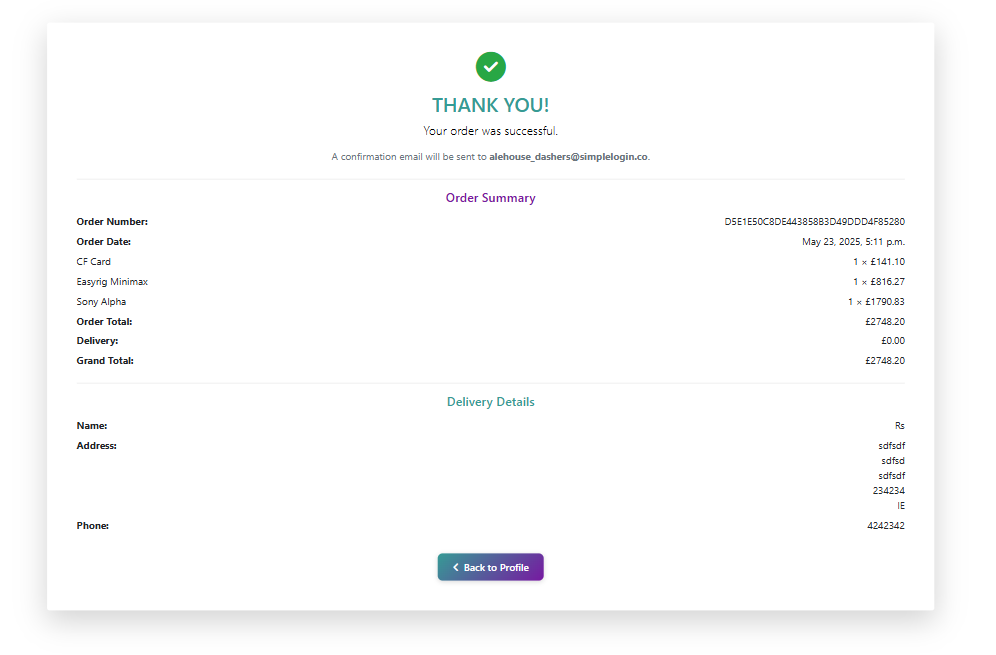

✅   As a user who may want to return, I would like to be able to make an account securely.

  I-Snap provides: 
      * Django all auth logic and templates for secure account sign up and login pages. The sign up page can be seen [here](documentation\readme_images\signup_page.png)

✅  As a user who has made an account, I expect to be able to change or update my information and login securely.

  I-Snap provides: 
      * an account profile with the users details stored in the database which they can edit and save to update shown [here](documentation/readme_images/profile_page.png).
      * a toast notification letting the user know when they have successfully updated their profile. This can be seen below.
     
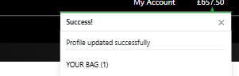

✅  be able to sign up to newsletters to keep up to date with products and company news.

  I-Snap provides: 
      * a newsletter signup located in the footer. This also forms parts of the projects CRUD functionality.
      * The function lets the user know when they have succesfully signed up.
      * Will let the user know if they have already signed up with a notifcation stating they have already submitted their email address fornewletter subscription.
     
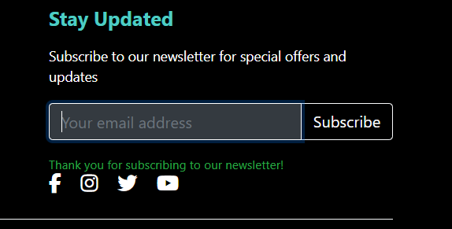

------

##### back to [top](#table-of-contents)

------

"**_As an administrator, I would like to_** _______________"

✅  update products on the front end.

  I-Snap provides: 
    * A product management system for signed in and authorised administrators.
    * edit product form link located on the product card for logged in users.
    * edit product form for updating existing products from the front end.
     
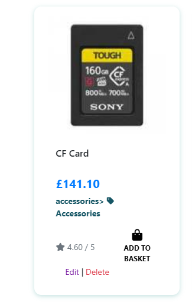

    * edit/update product for for existing products.

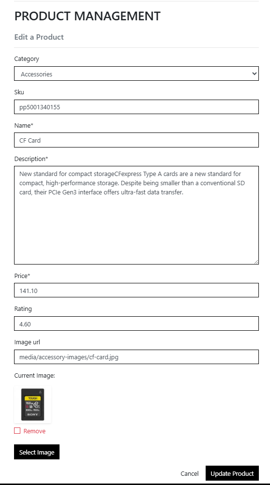

✅  add products from the front end.

  I-Snap provides: 
    * A product management system for signed in and authorised administrators.
    * product management form to add products and their relevant categories and a product image.
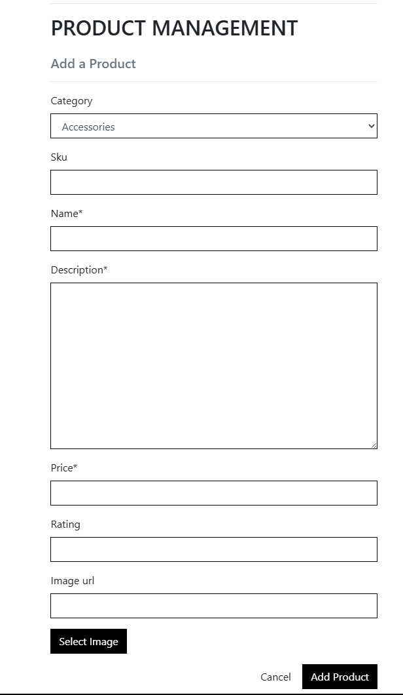

✅  delete products from the front-end and back end.

  I-Snap provides: 
    * A product management system for signed in and authorised administrators.
    * Delete product link on the product cards for logged in admin users.
     

✅  add, delete and update FAQ's

  I-Snap provides: 
    * an add faq form located in the faq page where the admin can add,delete and update FAQ's and its corresponding fields without having to submit it for approval, streamlining the process for admin.
    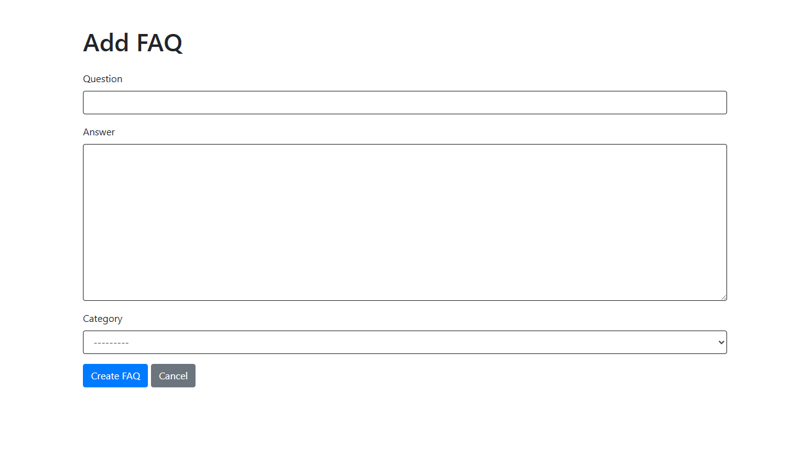
    * add FAQ form is accessed from the add FAQ button on the FAQ page only accessible to logged in admin users.
    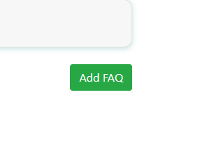
     

✅  know that i am logged in as admin and navigate to the admin features.

  I-Snap provides: 
    * a product management link in the user account submenu.
     
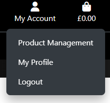

##### back to [top](#table-of-contents)

------

## Other Testing Methods

### Manual Testing

Behaviour driven Development (BDD) is where a project or product is tested to the user stories and by the user. This has also been done in responsiveness and compatability testing section above. 
This form of testing although useful in terms of user story testing can be subject to bias and sometimes things can get missed due to fatigue and is costly in time and resources. BDD is more user-centric and revolves around system behaviour. This is an Agile software development methodology.
It is particuarly useful as it can encompass a wide range of input from stakeholders to managers and is good for planning a project and monitoring throughout its entirety. Goals can be set along the projects way to delivery and measured.

- Below is a table of the manual user testing carried for home.

| **Feature**          | **Test Details**           | **Expected results**                      | **Pass/Fail** |                                             
| :-- | :-- | :-- | :-- |
| I-Snap Nav Logo Link | Click to redirect to index page | Links to start page | Pass |
| Signup Nav Link | Click to direct to signup page | Links to signup page , unless already logged in then redirect to user profile page | Pass |
| Login Nav Link | Click to direct to Login page | Links to login page, unless already logged in then redirect to user profile page | Pass |
| Logout Nav Link | Click to logout | Logs user out unless already logged out. redirects to login page. Toast Message successfully logged out shows | Pass |
| My Account menu (logged out) | Click My Account and select register or login. | Login link takes user to login page. Register link takes user to sign up page | Pass |
| My Account menu (logged in admin) | Click My Account and select Product management, register or login. | Product management takes admin user to product management page, Login link takes user to login page. Register link takes user to sign up page | Pass |
| Shopping bag link | Click shopping bag icon | takes user to their shopping bag | Pass |
| Shop Now link | Click shop now link | Links and directs user to products page | Pass |
| Login | Attempt login with registered username and password | logs user in and shows toast message to verify | Pass |
| Sign Up | Create user name and password, attempt login | Creates username and password. Logs in | Pass |
| Website search bar | Click the input box, enter search term, Click search icon | Presents likley results | Pass | 
| All products drop down links | Click all products in the nav bar | Drop down all products menu options show : price, rating, category, all products | Pass |
| Cameras drop down links | Click Cameras link in the nav bar | Drop down cameras menu options show : professional, instant, DSLR, all cameras | Pass |
| Lenses products drop down links | Click lenses link in the nav bar | Drop down lenses menu options show : sport, telephoto, all lenses | Pass |
| Special Offers drop down links | Click special offers link in the nav bar | Drop down all products menu options show : new arrivals, deals, clearance, all specials | Pass |
| Auto date change in footer | Check year is present and correct on loading | Shows current year in span in footer | Pass |
| Footer Home Link | Click Home Link in footer | Relaoads index.html home page | Pass |
| Footer Products Link | Click Products Link in footer | Directs user to the products page | Pass |
| Footer FAQ Link | Click FAQ Link in footer | Directs user to the FAQ's page | Pass |
| Footer Contact Link | Click Contact Link in footer | Directs user to the Contact page | Pass |
| Footer Instagram Link | Click Instagram Link in footer | Directs user to the instgram website in new tab | Pass |
| Footer Twitter Link | Click Twitter Link in footer| Directs user to the twitter website in new tab | Pass |
| Footer Facebook Link | Click Facebook Link in footer | Directs user to the Facebook website in new tab | Pass |
| 404 Page | Type unknown url extention in browser | Page loads when a page cannot be found or error occurs | Pass |
| 404 back to home button | Click take me home button | Redirects to index and links to index.html page on click | Pass |
| 404 Browse Products Button | Click Browse products button on the 404 page | Redirects user to products page | Pass |

- Below is a table of the manual user testing carried for products.

| **Feature**          | **Test Details**           | **Expected results**                      | **Pass/Fail** |                                             
| :-- | :-- | :-- | :-- |
| Website search bar | Click the input box, enter search term, Click search icon | Presents likley results | Pass |
| All products by price | Click the by price option in all products dropdown | Renders all products by price | Pass |
| All products by rating | Click the by rating option in all products dropdown | Renders all products by rating | Pass |
| All products by category | Click the by pcategory option in all products dropdown | Renders all products by category default category group a-z | Pass |
| All products  | Click the All Products option in all products dropdown | Renders all products by price | Pass |
| Professional cameras  | Click the professional option in cameras dropdown | Renders cameras categorised as professional | Pass |
| Instant cameras  | Click the instant option in cameras dropdown | Renders cameras categorised as instant | Pass |
| DSLR cameras  | Click the DSLR option in cameras dropdown | Renders cameras categorised as DSLR | Pass |
| All Cameras  | Click the All cameras option in Cameras dropdown | Renders all cameras | Pass |
| Sport Lenses  | Click the sport option in lenses dropdown | Renders lenses categorised as sport | Pass |
| Telephoto Lenses  | Click the telephoto option in lenses dropdown | Renders lenses categorised as telephoto | Pass |
| All Lenses  | Click the all lenses option in lenses dropdown | Renders all lenses | Pass |
| New Arrivals  | Click the new arrivals option in special offers dropdown | Renders products categorised as a new arrival | Pass |
| Deals  | Click the deals option in special offers dropdown | Renders products categorised as a deal | Pass |
| Clearance  | Click the clearance option in special offers dropdown | Renders products categorised as a clearance | Pass |
| All Specials  | Click the all specials option in special offers dropdown | Renders products categorised as a special | Pass |
| Product sort dropdown | Click the sort dropdown bar | Dropdown shows various sorting categories to display products by | Pass |
| Product sort Price (low to high) | Click the sort dropdown bar, click Price (low to high) | Products are shown in order of price ascending | Pass |
| Product sort Price (high to low) | Click the sort dropdown bar, click Price (High to low) | Products are shown in order of price descending | Pass |
| Product sort Rating (high to low) | Click the sort dropdown bar, click rating (low to high) | Products are shown in order of rating ascending | Pass |
| Product sort Rating (low to high) | Click the sort dropdown bar, click rating (high to low) | Products are shown in order of rating descending | Pass |
| Product Name (a-z) | Click the sort dropdown bar, click name (a-z) | Products are shown in order of name in alphabetical order a-z | Pass |
| Product Name (z-a) | Click the sort dropdown bar, click name (z-a) | Products are shown in order of name in reverse alphabetical order z-a | Pass |
| Category (a-z) | Click the sort dropdown bar, click category (a-z) | Products are shown in order of category in alphabetical order a-z | Pass |
| Category (z-a) | Click the sort dropdown bar, click category (z-a) | Products are shown in order of category in reverse alphabetical order z-a | Pass |
| Hover effects | Hover over product card | Purple hover effect and translate shows movement | Pass |
| Product card Category Link / Filter | Click category links on product card | Product page displays selected category from product card | Pass |
| Add to basket button - Product Card | Click add to basket button on a product card | Product is added to bag confirmed by toast success message and bag icon total updates | Pass |
| Products Home Link | Click Products home text link in top left of product screen | Displays all products and resets filters to default (none) | Pass |
| Product total display | Select category, verfiy amount of displayed products matches total product display | Pass |

- Below is a table of the manual user testing carried for bag.

| **Feature**          | **Test Details**           | **Expected results**                      | **Pass/Fail** |                                             
| :-- | :-- | :-- | :-- |
| Shopping bag link | Click shopping bag icon | takes user to their shopping bag | Pass |
| Go to checkout button - Bag modal | Click the go to checkout button in bag modal | Direct user to shopping bag | Pass | 
| Empty Bag Message | Click shopping bag icon from products pag when bag is empty | 'Your shopping bag is empty' message displayed | Pass |
| Continue Shopping Link | Click continue shopping text link in bag page | Redirects user to all products page | Pass |
| Product in bag | Check product has correct info, image, price , quantity and subtotal | Pass | 
| Product quantity update and total | Add or subtract product quantity using plus and minus buttons, click update | Updates product quantity as expected and total updates in correlation to this | Pass |
| Remove product function | Click remove when an item is present in the bag | Removes quantity of selected item from the bag, toast message to confirm shows | Pass |

- Below is a table of the manual user testing carried for checkout.

| **Feature**          | **Test Details**           | **Expected results**                      | **Pass/Fail** |                                             
| :-- | :-- | :-- | :-- |
| Secure checkout button - Bag page | Click the go to checkout button in bag page | Direct user to checkout page | Pass |
| Name Field - Required | Try to submit form without name field completed | Warning message asking to complete the field shows, does not process form | Pass |
| Email Field - Required | Try to submit form without email field completed, and with no @ in email address | Warning message asking to complete the field shows, does not process form | Pass |
| Phone Number Field - Required | Try to submit form without phone number field completed | Warning message asking to complete the field shows, does not process form | Pass |
| Country Field - Required | Try to submit form without a selected country | Warning message asking to complete the field shows, does not process form | Pass |
| Country Field | Click field and ensure all countries are selectable by selecting each one | All countries are selectable | Pass |
| Town/City Field - Required | Try to submit form without town/city field completed | Warning message asking to complete the field shows, does not process form | Pass |
| Street Address 1 Field - Required | Try to submit form without street address 1 field completed | Warning message asking to complete the field shows, does not process form | Pass |
| Card Number | Enter stripe test card number (VALID) | Only takes a valid card number, notifies if incomplete | Pass |
| Card expiry date | Enter valid expiry date | Only takes a valid expiry date, notifies if incomplete | Pass |
| Card security number | Enter 3 digit code | Only takes a 3 digit code, notifies if incomplete | Pass |
| Card Registered Zip Code | Enter valid zip code | Only takes a valid zip code in relation to selected country, notifies if incomplete | Pass |
| Complete order button | Click button once checkout form is complete | Only processes payment and order when the form is complete, directs user to the order confirmation page | Pass |
| Adjust Bag Link | Click the adjust bag link | Directs user back to the shopping bag | Pass |

- Below is a table of the manual user testing carried for profiles.

| **Feature**          | **Test Details**           | **Expected results**                      | **Pass/Fail** |                                             
| :-- | :-- | :-- | :-- |
| My Account | Whilst logged out click on my account in the nav bar | Register and Login links appear on a drop down | Pass |
| User Dashboard Profile | Login as user and navigate to userdashboard | User dashboard displays username in the profile card | Pass |
| Sign Up | Create user name and password, attempt login | Creates username and password. Logs in | Pass |
| Log In | Attempt login with username and password used for signup | Logs in with registered credentials | Pass |
| Logout | Click link in admin and user navbar | Logs user out and redirects to login page | Pass |

- Below is a table of the manual user testing carried for contact.

| **Feature**          | **Test Details**           | **Expected results**                      | **Pass/Fail** |                                             
| :-- | :-- | :-- | :-- |
| Contact Page | Click contact us Link in footer quick links. Ensure contact page loads as expected | contact page loads as expected | Pass |
| Contact styling effects | Hover over send message button and ensure hover effects work | Hover effects work as expected | Pass |
| Contact form text input | Click  and ensure the forms take the required text in correct format | Takes input as expected | Pass |
| Contact form submission confirmation | After inputting text click send message button | Success message modal appears with close button and closes upon clicking button | Pass |

- Below is a table of the manual user testing carried for FAQ's.

| **Feature**          | **Test Details**           | **Expected results**                      | **Pass/Fail** |                                             
| :-- | :-- | :-- | :-- |
| FAQ Page | Click FAQ Link in footer quick links. Ensure FAQ page loads as expected | FAQ page loads as expected | Pass |
| FAQ styling effects | Hover over accordion section and ensure hover effects work | Hover effects work as expected | Pass |
| FAQ accordion category section expansion | Click FAQ category sections and ensure they expand with FAQ's as expected | Expand and reveal FAQ questions as expected | Pass |
| FAQ accordion category section contraction | Click faq category sections when open and ensure they contract to hide FAQ's as expected | Contracts and hides FAQ questions as expected | Pass |
| FAQ Questions expands to reveal answer | Click FAQ questions in a category and ensure answer is revealed | FAQ answer is revealed as expected. | Pass |
| FAQ Questions contracts to hide answer | Click FAQ questions in a category and ensure answer is hidden | FAQ answer is hidden as expected. | Pass |
| Admin Action Button (Add) | Ensure logged in as a superuser (@admin required), Click add FAQ button | Directed to Add FAQ page | Pass |
| Admin Add FAQ Page | Enter a question, answer and select category from relevant fields. Click Create FAQ button, navigate to faq page to check questions and answer is added in selected category | Question and answer has been added to selected category| Pass |
| Admin Action Button (Cancel) | Navigate to the Add FAQ page. Click the grey cancel button next to the create FAQ button. | Admin user is redirected back to the FAQ page | Pass |

- Below is a table of the manual user testing carried for the newsletter.

| **Feature**          | **Test Details**           | **Expected results**                      | **Pass/Fail** |                                             
| :-- | :-- | :-- | :-- |
| Newsletter signup input | Click email input and takes only an email address | Takes email address. Turns white on completion | Pass |
| Newsletter Subscribe Button Hover | Hover over subscribe button and ensure hover effects work | Hover effects work as expected | Pass |
| Newsletter Subscribe Button Submission New | Click submit button after inputting email address | Green message notifying user of suibscription shows if not previously submitted | Pass |
| Newsletter Subscribe Button Submission Pre-existing | Click submit button after inputting email address | Red message notifying user of existing suibscription shows if previously submitted | Pass |

##### back to [top](#table-of-contents)

------

### Automated Testing

Various language specific frameworks are available to run automated testing. One of the most popular is Jest for testing JavaScript. 

It is best to combine manual and automated testing. Automated tests will not test user experience and tests will only ever be as good as the questions we ask it to perform.

#### Bag App Test (BagViewTest)

The BagViewTests class is designed to comprehensively test the main features and user interactions of the bag (shopping cart) functionality in the application. It uses Django’s built-in test client to simulate user actions and verify that the bag behaves as expected.

Test Coverage
The tests cover the following core features:

Viewing the Bag
Adding Items to the Bag
Adjusting Item Quantities
Removing Items from the Bag
1. Viewing the Bag
Test: test_view_bag_get
Purpose: Ensures that the bag page is accessible and renders correctly.
How:
The test sends a GET request to the bag page using the URL pattern 'view_bag'.
It asserts that the response status code is 200 (OK) and that the correct template is used.
Why:
This confirms that users can always access their bag and that the view and template are set up correctly.
2. Adding Items to the Bag
Test: test_add_to_bag
Purpose: Verifies that a user can add a product to their bag.
How:
The test simulates a POST request to the add_to_bag view, sending the product ID, quantity, and a redirect URL.
It checks that the response redirects to the correct page and that the session data contains the correct product and quantity.
Why:
This ensures that the add-to-bag functionality works, the session is updated, and the user receives appropriate feedback.
3. Adjusting Item Quantities
Test: test_adjust_bag
Purpose: Ensures that users can change the quantity of an item already in their bag.
How:
The test first adds a product to the bag, then simulates a POST request to the adjust_bag view with a new quantity.
It asserts that the session data reflects the updated quantity (not the sum of old and new, but the new value).
Why:
This test checks that the adjust functionality sets the quantity as expected, matching user intent and preventing accidental over-adding.
4. Removing Items from the Bag
Test: test_remove_from_bag
Purpose: Verifies that users can remove items from their bag.
How:
The test adds a product to the bag, then simulates a POST request to the remove_from_bag view.
It checks that the product is no longer present in the session bag data.
Why:
This ensures that the remove functionality works and that users can manage their bag contents as expected.
Why These Tests Matter
Reliability: They ensure the bag’s core features work as intended after every code change.
User Experience: They help guarantee that users can add, adjust, and remove products without unexpected behavior.
Regression Prevention: They catch bugs early, especially after refactoring or adding new features.

On the first test the app failed. The image of the terminal can be seen below.

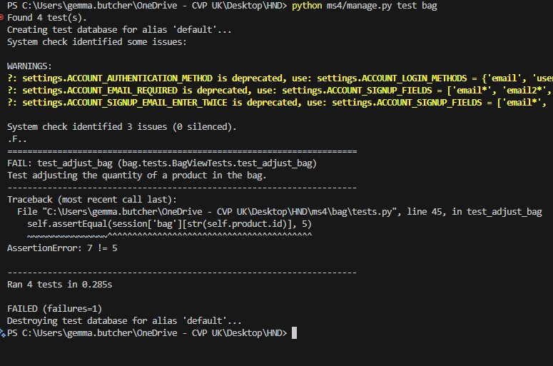

What Was Wrong
Previously, the adjust_bag view was adding the new quantity to the existing quantity in the bag.
For example, if the bag already had 2 of an item in the bag and you tried to "adjust" it to 5, the code would add 5 to 2, resulting in 7.
This is not the expected behavior for an "adjust" action—users expect the quantity to be set to the new value, not increased by it.

What the Fix Does:
The fix changes the logic so that when you adjust the quantity of an item in the bag, it sets the quantity to the new value provided by the user, rather than adding to the existing quantity.

Key Line Changed:
Before (incorrect): bag[item_id] += quantity

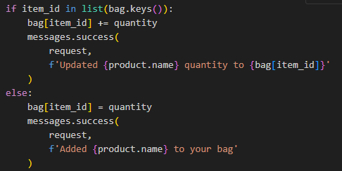

After (correct): bag[item_id] = quantity

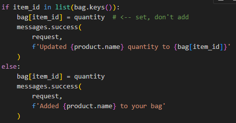
 
How the Fixed Code Works
Retrieve the Bag:
The bag is fetched from the session. If it doesn’t exist, an empty dictionary is used.

Check for Product Size:
If the product has sizes (like S, M, L), the code adjusts the quantity for the specific size.

Adjust Quantity (No Size):

If the item is already in the bag, its quantity is set to the new value (bag[item_id] = quantity).
If the item is not in the bag, it is added with the specified quantity.
Save the Bag:
The updated bag is saved back to the session.

Redirect:
The user is redirected to the appropriate page.

Why This Fix Is Important
Correct User Experience:
When users adjust the quantity of an item in their bag, they expect the number to be exactly what they set, not the sum of the old and new values.

Test Consistency:
The automated tests expect the quantity to be set, not added. This fix ensures your tests pass and your app behaves as users expect.

Prevents Over-Adding:
Without this fix, users could accidentally end up with more items in their bag than intended.

In summary:
The fix ensures that "adjusting" a bag item sets its quantity to the user’s chosen value, matching both user expectations and your test logic.
The test pass returning a print to the terminal of 'ok' can be seen below

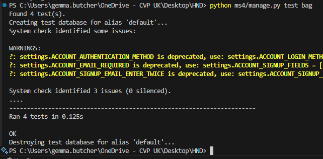

#### Contact App Test (ContactViewTest)

##### Contact App Automated Test Summary

The automated tests for the contact app ensure both the accessibility and functionality of the contact form:
Below is an image of the test file followed by the summary. 
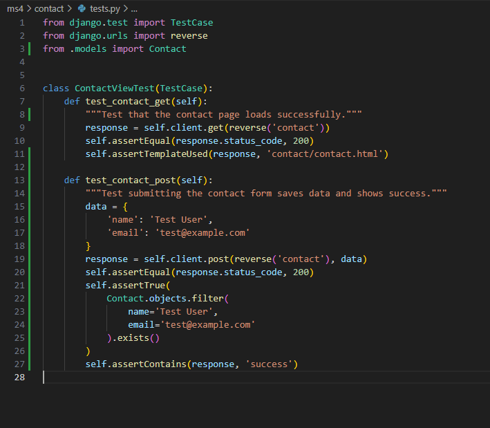 

1. GET Request Test
Purpose:
Verifies that the contact page loads successfully when accessed by a user.
How it works:
The test sends a GET request to the contact page URL and checks that the server responds with a status code 200 (OK).
It also confirms that the correct template (contact/contact.html) is used to render the page.
Why it matters:
This ensures that users can reach the contact form without errors and that the page is set up correctly in the Django project.

2. POST Request Test
Purpose:
Simulates a user submitting the contact form and verifies that the form data is processed correctly.
How it works:
The test sends a POST request with sample form data (name and email) to the contact page.
It then checks that:
The response status is 200, indicating the page reloads successfully.
The submitted data is saved in the database (i.e., a new Contact object is created).
The response contains a success indicator, confirming that the user receives feedback after submitting the form.
Why it matters:
This test ensures that the contact form works end-to-end: users can submit their information, the backend processes and stores the data, and users receive confirmation that their message was sent.
In summary:
These tests provide confidence that the contact page is always accessible and that the contact form reliably accepts and stores user submissions, helping to catch issues early in development or after changes.
The confirmation that the test passed with aan output of 'ok' is shown below in the terminal.
 

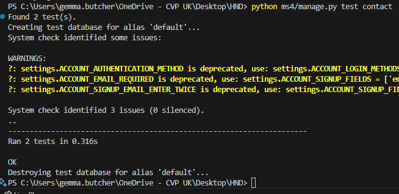 

## Further Testing

 * A large amount of testing was carried out to ensure that all pages, buttons, feedback and functions were working correctly.

 * Friends and family members were asked to review the site and documentation to point out any bugs and/or user 
      experience issues.

##### back to [top](#table-of-contents)